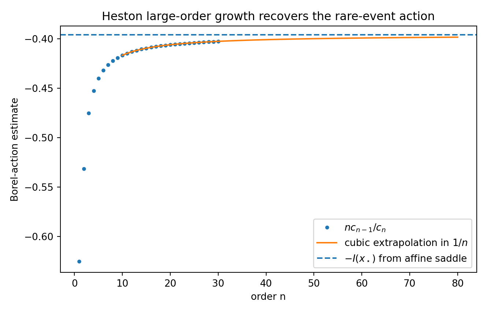

# Resurgent Asymptotics of Heston Rare-Event Tails

**Exploratory computational research project · manuscript v1.0 · not peer reviewed.**

This project asks whether saddle-point geometry and high-order asymptotics of a *small-noise deformation* of the Heston stochastic-volatility model can be related through Borel analysis. This is a mathematical investigation of a specified tail observable; it does **not** assert that markets are quantum systems or that the model predicts crashes or trading returns.

## Research question and method

For a fixed left-tail event of the log return, compare the rare-event rate obtained from the affine cumulant-generating function with an independent Hamiltonian/large-deviation computation, then probe the large-order fluctuation coefficients, adjacent complex saddles and Borel–Padé singularity locations. Numerical continuation explores what happens near a saddle collision, where an Airy-type uniform approximation is relevant.

**Reference parameters:** `kappa=2, theta=v0=0.04, xi=0.45, rho=-0.7, T=1, x*=-0.25`.



The manuscript includes a more extensive numerical study of Borel singularities, Stokes data and caustics. These are numerical research claims, **not proven global theorems**. In particular, portions of the costly high-order, Stokes and post-caustic calculations have not yet been independently regenerated from scratch; some successful scripts read precomputed coefficients. See [exact replication status](HEAVY_REPLICATION_STATUS_2026-09-16.md) and [technical audit](SCIENTIFIC_AUDIT_2026-09-16.md) before citing quantitative claims.

## Manuscript and source

- [Research manuscript (PDF)](paper/resurgent_stochastic_finance.pdf) and [LaTeX source](paper/main.tex).
- [Numerical methods](src/ftfinance/) and [experiment entry points](experiments/).
- [Reference figures](figures/), [numerical outputs](results/) and [detailed methodology](REPRODUCIBILITY.md).

The PDF reflects the original v1.0 experiments, not a subsequently peer-reviewed or fully reproduced revision. The current Python code includes later fixes; the PDF and stored outputs have **not** all been regenerated with those fixes.

## Verify locally

```bash
python -m venv .venv
# Activate the environment for your operating system.
python -m pip install -e ".[dev]"
python -m pytest -q tests
```

The quick test suite passed **24 tests in a local audit copy**; this is an internal regression check, not an independent scientific validation. For the three shorter numerical examples, use `python reproduce.py --benchmarks`. The expensive extended scripts should be run separately, in a disposable copy, with adequate time and memory: they can overwrite reference outputs. See [reproduction notes](REPRODUCIBILITY.md).

## Authorship, credit and rights

**Research project attributed to Rodrigo Varela.** [Citation metadata](CITATION.cff). The project was developed with computational/editorial assistance, and the listed author remains responsible for checking the derivations, code, interpretation and appropriate attribution before publication or academic submission. It is not presented as an independently refereed paper.

[Copyright and reuse notice](COPYRIGHT.md). No new open-source reuse licence is granted by the **current** release. An older version was published under MIT, and this change does not revoke rights already granted for that licensed version. Public GitHub visibility still permits viewing and forking under GitHub's terms. Third-party dependencies retain their own licences.
